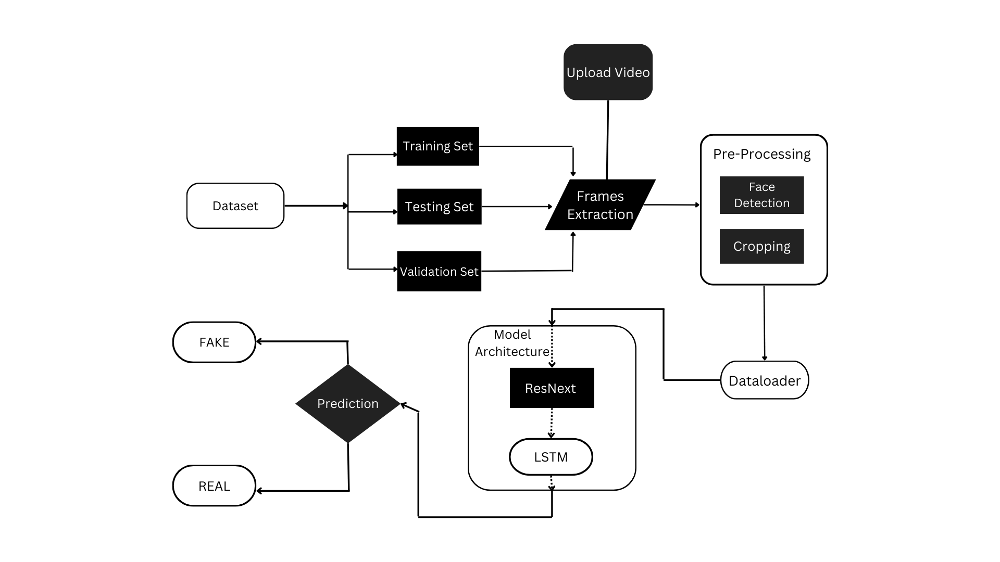

# DeepFake Detection Model

## 1. Introduction
This projects aims in detection of video deepfakes using deep learning techniques like ResNext and LSTM. We have achived deepfake detection by using transfer learning where the pretrained ResNext CNN is used to obtain a feature vector, further the LSTM layer is trained using the features.

## 2. System Architecture

  

## 3. Website Implementation

    

    

## 4. Results

| No of videos | No of Frames | Accuracy |
|--------------|--------------|----------|
|6000 |10 |84.21461|
|6000 |20 |87.79160|
|6000| 40 |89.34681|
|6000| 60 |90.59097 |

